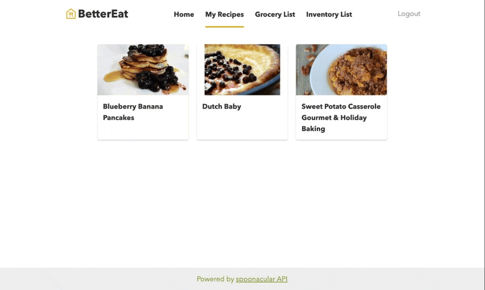
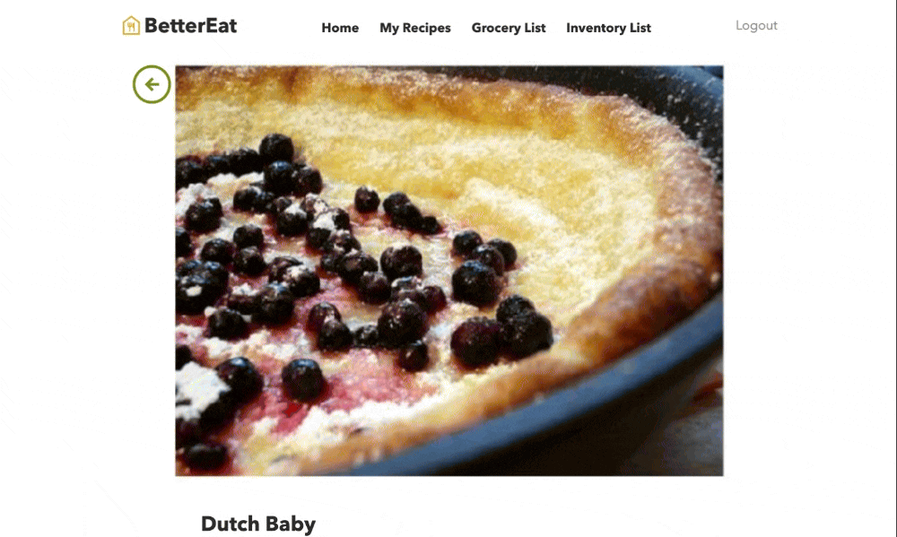
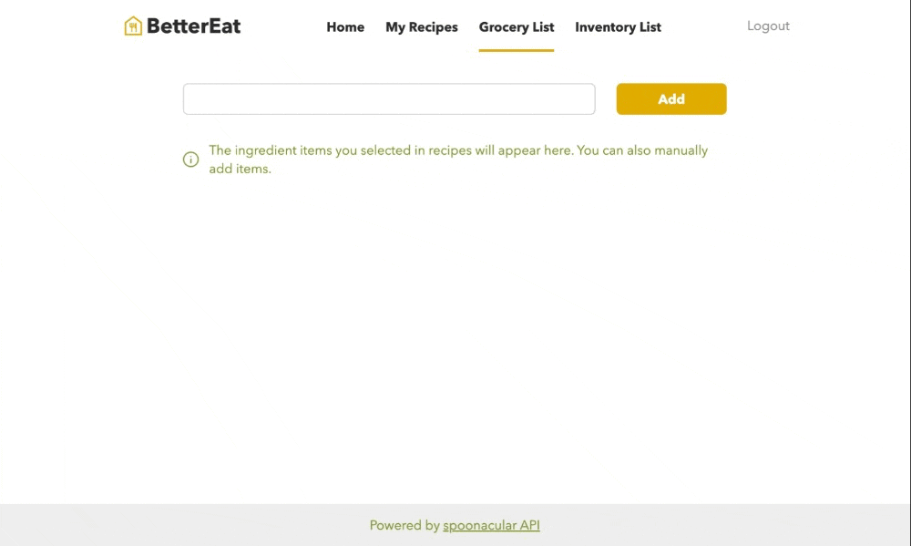
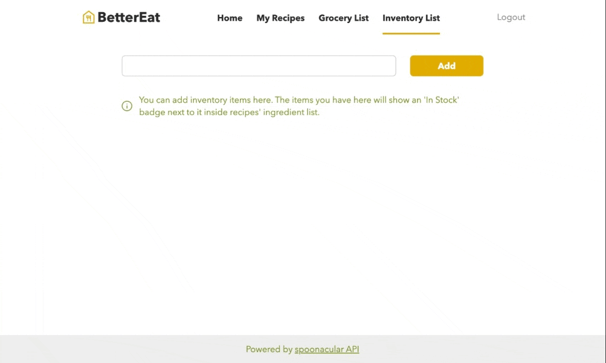

# BetterEat Front-end

BetterEat is a web application that helps users to cook more and eat healthier by suggesting recipes based on their food preferences. Users can also manage their meal plans with stored information such as recipes, inventory and grocery lists.

You can visit the live website at http://better-eat.hyuncholjun.com/.

The recipe data is obtained from [Spoonacular API](https://spoonacular.com/food-api).

## Tech stack
- React
- React-router-dom
- Sass
- Styled-components
- Axios

## Authentication

BetterEat uses an email address as the user ID for the website. It doesn't need to be a valid email address as long as it's in the email format and unique(not already existing.) The server doesn't store the password. Instead, it keeps the hash with the [bcrypt](https://www.npmjs.com/package/bcrypt) library.

## Pages

### Home page

Users can set their food preferences, such as diet, cuisine, and intolerance and search for recipes based on them. The settings will be stored in the browser's local storage and will persist unless the user deletes the storage.
Once set, every time the user visits the website, it will recommend random recipes based on the selected preferences. Users can also search for recipes with the keywords such as ingredient names.

### My recipes

All the recipes that the user has saved will appear on this page.

### Recipe detail

When the user clicks one of the recipe cards, they will enter the detail page. Here they can save/delete the recipe and see the information about it.
The ingredients on this page are buttons and, when clicked, will save the item to the Grocery list page.

### Grocery list

All the grocery items the user has saved will appear on this page. Users can also manually type in grocery items; as long as they are unique (checked by MySQL's unique constraint), they will be added.
When the user leaves the page, checked-off items will be deleted from the server.

### Inventory list

Here, users can add/delete items. They can also search for recipes with the keywords with a simple button click next to them.
When users browse through recipes 'In Stock' badge will appear next to the ingredient item in the recipe if the user has the item in their inventory list.
